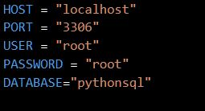

# Console-Based-Application-Python-with-MySql


The Aim is to Perform Operations (Read, Insert, Delete and Update) with MySQL using python.

## setup
To create a project from scratch use following steps - -

- Clone the repository : https://github.com/ni3choudhary/Console-Based-Application-Python-with-MySql.git

- Inside the project root directory, Create Conda Environment using below command.
```console
$ conda create -p myenv python=3.8.6
``` 

Activate Conda Environment
```console
$ conda activate myenv
```
Install Libraries using below command or you can use conda commands also for installation if below command doesn't work for you.
```console
$ pip install -r requirements.txt
```

- Now create a new database using the below query.
```console
create database pythonsql;
```

- Create a .env file in root directory with below details.
```console
HOST = "localhost"
PORT = "yourmysqlport"
USER = "yourmysqlusername"
PASSWORD = "yourpassword"
DATABASE="pythonsql"
```
#### for reference you can check the image


- Now  run **main.py** on terminal.
```console
$ python main.py
```

• Please do ⭐ the repository, if it helped you in anyway.